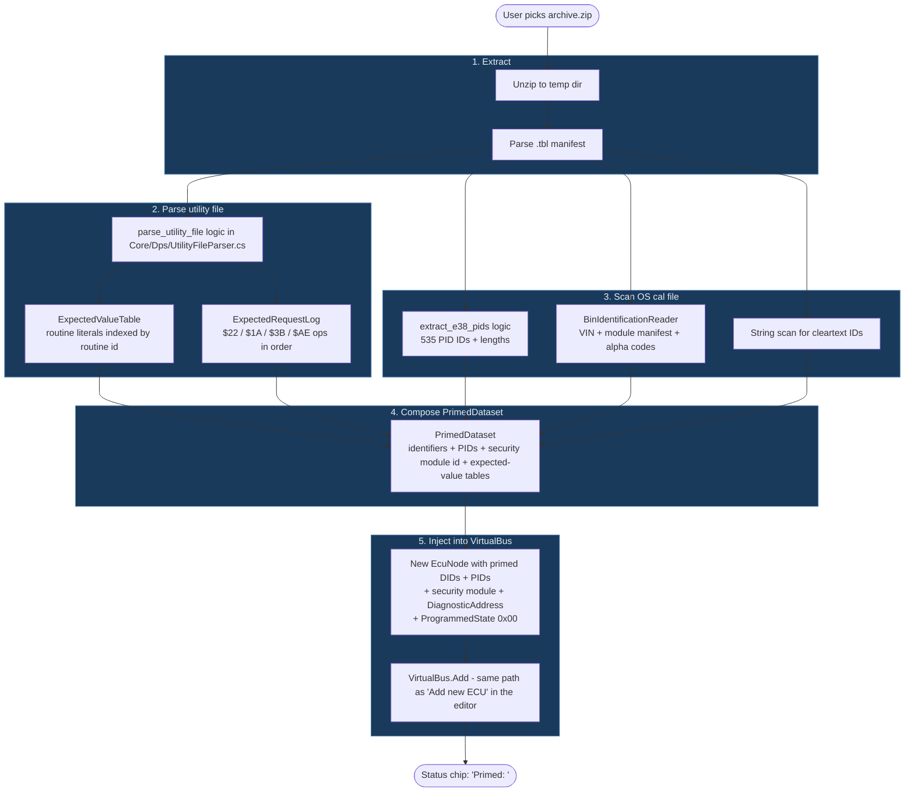

# Core/Dps - Prime-From-Archive design

Status: **MVP shipped 2026-05-16.** Both validated archives drive DPS to "Programming Successfully Ended." Sections 1-14 are the original design; §0 below captures the post-implementation findings that diverged from the design.

Sibling docs:
- [tools/dps_utility_builder/reports/e38_dps_flow_2011_silverado.md](../../tools/dps_utility_builder/reports/e38_dps_flow_2011_silverado.md) - the worked-example flow diagram this design was derived from.
- [tools/dps_utility_builder/reports/e38_bin_extraction_survey.md](../../tools/dps_utility_builder/reports/e38_bin_extraction_survey.md) - what is statically extractable from an E38 OS bin.
- Memory: `project_dps_e2e_validated.md` (e2e baseline + fix list), `project_prime_from_archive_shipped.md` (feature reference), `reference_dps_utility_file_format.md` (interpreter wire format).

---

## 0. Post-implementation findings (read this first)

Three things changed materially during implementation. Update the corresponding original section as you go.

### 0a. The archive boot region is not shipped, and family detection from an archive was abandoned

**Original assumption (§5, §11):** `BinIdentificationReader` could be invoked on the archive's OS module to recover family + identifier DIDs. **Actual:** archives contain only the OS region (flash `0x010000` and up). The PowerPC service dispatcher cluster lives at flash `~0x006900` (boot region) - not in the archive. So `Parse` returns null on archive OS modules. The walker remains useful only for full 2 MiB readbacks fed in via Load-Info-from-Bin.

**What ships instead:** `BinIdentificationReader.ReadArchiveOsHeader` extracts the 8-digit ASCII OS part number + 2-char alpha code from the per-module header at file offset `0x0E`/`10`. The header is surfaced in the Prime Report for human inspection, but **no longer feeds family inference**. The earlier `FamilyFromOsPartNumber` table and archive-filename-prefix sniffing were removed per the donor-only stance (see `feedback_no_os_pn_database.md` in memory). `PrimeReport.Family` is hardcoded `null` in [ArchivePrimer.cs:130](ArchivePrimer.cs:130). Security-module selection is now driven by `PickSecurityModule` reading the utility-file's `$27 Action[1]` algoId; see §0e below.

### 0b. PidResponseSolver replaced "NRC-only tier 3"

**Original assumption (§5):** tier-3 PIDs would return NRC `$31`. **Actual:** `PidResponseSolver` walks the utility-file `$54`/`$53` cascade and emits a `byte[]` per `$22` PID the script reads. The bytes are computed: for each cascade-modified position, if a `$53` compare's expected value is a bit-subset of the AND-mask, the solver sets those bits; otherwise leaves clear. PIDs the script never reads stay unregistered (still return NRC `$31` - the original tier-3 intent). Satisfied + unsatisfiable compare counts surface in `PrimeReport`.

### 0c. SpsType removed entirely

**Original assumption (§7):** SpsType.C activation gates would still exist for blank-ECU dispatch. **Actual:** the entire enum + persona gate were removed. Every ECU is always-on Type-A behavior. DPS dispatch sequence works against always-on ECUs identically (it always issues the same broadcasts; the gates were never necessary).

### 0d. Two security fixes landed during validation

- **Bypass-by-policy unlocks at requestSeed.** `Gmw3110_2010_Generic.HandleBypass` requestSeed branch now sets `SecurityUnlockedLevel = level` along with emitting the all-zero seed. Without this, DPS's "seed `00 00` means already unlocked" shortcut leaves the ECU still locked and `$34` returns NRC `$22`.
- **Module-change resets security state.** `EcuViewModel.ApplyModuleSelection` calls `ResetSecurityState()` so switching algorithms doesn't inherit the prior module's unlock state. Without this, a session with bypass followed by a session with algo 92 silently runs through the spec's "already unlocked -> seed=00 00" branch instead of actually exercising algo 92.

### 0e. Security module is picked from the utility file's `$27` instruction

**Original assumption (§7 area):** family detection drives the security module choice. **Actual:** `ArchivePrimer.PickSecurityModule` ([ArchivePrimer.cs:266](ArchivePrimer.cs:266)) walks the parsed utility file and reads the first `$27` instruction's `Action[1]` algoId. Non-zero -> `gm-e92-5byte` with `{algoId: "0xNN"}` config (the DPS-style 5-byte cipher in `Gm5ByteAlgorithm`). Zero or absent -> `gm-bypass-2byte` (the `RandomSeedCipher` wrapped with `SecurityModuleBehaviour.BypassAll`). No family lookup, no filename sniffing. The Algo 92 cipher itself was fully extracted on 2026-05-17 - see `reference_dps_algo92_extracted.md` in memory for provenance.

---

## 1. Goal

A user points the simulator at a DPS archive (`.zip`) once. The simulator ingests everything it can statically know about the target ECM from that archive plus its embedded bin, primes its persona accordingly, and survives the full DPS programming session end-to-end.

**Gold:** one E38 archive (the validated 2011 Silverado baseline) primes and survives without any manual ECU configuration.
**Platinum:** the same flow works against any ECM/TCM archive in `C:\DpsArch\`, including the 5-byte-security variants, without ECM-specific code changes.

The user-facing value: a consumer developing their own flash routine points their tool at the simulator and develops against it with confidence that DPS-equivalent traffic is handled correctly. Bootloader execution is the explicit hard limit (see §9).

## 2. Architectural principle

**Spec-fidelity is non-negotiable.** No existing protocol handler is modified by this feature. Prime-from-Archive is a pure *data-plane* feature: it builds a `PrimedDataset` that the existing handlers consume the same way they consume hand-typed config today. If a handler's spec-correct response depends on a value the dataset cannot supply, the handler returns the spec-defined NRC. Any deviation is flagged in the Prime Report (§8), never silently chosen.

## 3. Entry points

1. **WPF menu:** File -> Prime from DPS archive... (opens file picker; archive path persists into `ecu_config.json` as `primeArchivePath`).
2. **CLI:** `GmEcuSimulator.exe --prime <archive.zip>` (scripted-test entry).
3. **Auto-load:** if `primeArchivePath` is set in config, prime runs at startup before the named-pipe server accepts connections.

## 4. The pipeline



### Step detail

| Step | What | Where (future code) |
|--:|---|---|
| 1 | Unzip to temp dir, parse `.tbl` manifest to find the Utility File entry vs the Description-of-Cal entries | `Core/Dps/ArchiveExtractor.cs` |
| 2 | Parse the utility file: interpreter steps, routine literals, service/DID call-list | `Core/Dps/UtilityFileParser.cs` (port of `tools/dps_utility_builder/parse_utility_file.py`) |
| 3a | Scan the OS cal file for the 535-entry PID table | `Core/Dps/E38PidExtractor.cs` (port of `extract_e38_pids.py`) |
| 3b | Run `BinIdentificationReader` over the OS cal file for identifiers | `Core/Identification/BinIdentificationReader.cs` (exists) |
| 3c | Optional cleartext-string scan for version stamps and build IDs | `Core/Dps/StaticStringScanner.cs` |
| 4 | Build the `PrimedDataset` aggregating everything | `Core/Dps/PrimedDataset.cs` |
| 5 | Build an `EcuNode` from the dataset, register on the bus | `Core/Dps/ArchivePrimer.cs` (the public entry point) |

## 5. PID value strategy

For every PID in the 535-entry table from step 3a, the value is set via these tiers in order:

| Tier | Source | Tag | Action |
|--:|---|---|---|
| 1 | Bin-extracted cleartext bytes at the PID's address | `bin` | Use the bytes as `StaticBytes` |
| 2 | Utility-file `$54 CHANGE_DATA` cascade that statically resolves to a constant | `archive` | Use that constant as `StaticBytes` |
| 3 | No value available | `none` | Handler returns NRC `$31 requestOutOfRange` |

**Zero-fill is rejected.** Returning `0x00` bytes for a PID claims "supported, value is zero" - not spec-truthful. NRC `$31` is the correct response for an unsupported PID and DPS's info sweep tolerates it.

This decision is **provisional**. Sign-off is "ship NRC `$31`, watch the Prime Report's tier-3 count, revisit if DPS actually rejects the sweep on too many NRCs." Revisit options if needed:
- Expand the bin scanner to extract more PIDs (preferred).
- Add per-archive override file with hand-supplied values.
- Last resort: an opt-in `--zero-fill-unknown` flag with a banner warning.

## 6. VIN strategy

Order:
1. Call `BinIdentificationReader` on the OS cal file. It already probes both `0xC0AC` and `0xE0AC` per [Core/Identification/BinIdentificationReader.cs:656](../Identification/BinIdentificationReader.cs:656). If it finds a VIN descriptor, use it.
2. Otherwise fall back to the archive filename if it parses as a 17-char VIN (e.g. `E38_1GCRKSE36BZ158034.zip` -> `1GCRKSE36BZ158034`).
3. Otherwise the prime fails with "could not derive VIN" and the user is asked to set one manually.

VIN is tagged in the Prime Report with its source: `bin@0xC0AC`, `bin@0xE0AC`, or `archive-filename`. The Continental-vs-Bosch disambiguation already handled in `BinIdentificationReader` is unchanged.

VIN populates DID `$90` (`Service1A`) and is what DPS's VIT2 record `0x41` compares against in Phase 3 `$53` ops.

## 7. SPS type and persona

**Removed from the simulator as of this session.** Every ECU is always-on; the SPS_TYPE_C activation gate (silent-until-`$A2`+`$28`) no longer exists. See the same-session commit removing the enum + dispatch gate.

This simplifies Prime-from-Archive: we do not infer SPS type from the archive, because there is no SPS type. The dispatch sequence DPS issues (`$28`+`$A2` functional, `$1A B0` functional) is handled by the standard always-on handlers - the simulator responds because it always responds, not because of a state flip.

If future archives require silent-until-activated semantics (none observed yet), reintroduce as an opt-in `RequireActivation` flag on `EcuNode`, scoped to that archive only, with the gate built into the data layer rather than the persona switch.

## 8. Flag-for-review list

Surfaces at prime-time in the Prime Report dialog. None of these block the flow; all are visible.

| Flag | Trigger | Action |
|---|---|---|
| `$1A C1` kernel-ready timing | Always emitted - choice of NRC family for the pre-kernel poll loop | Confirm against GMW3110 §8.3 NRC table per ECU family. Default: NRC `$31` requestOutOfRange. Real-world spec answer may be `$22` conditionsNotCorrect or `$78` responsePending - flag until validated against a bus capture. |
| Routine[N] big-blob `$53` compare | Any routine larger than 16 bytes referenced by a `$53` op with `actionFields[3]=1` | Likely a CRC-target or memory-region anchor. Compute the corresponding CRC over the virtual-flash buffer if the polynomial can be identified; otherwise log the routine size + which `$53` step references it and accept the fail-branch. |
| VIT2-dependent compare | Any `$53` with `actionFields[3]=0` referencing a VIT2 record the simulator cannot derive from the archive | Log the VIT2 record ID. VIN is record `0x41` (handled). Other records (tester ID, repair shop, programming date) belong to DPS-side session state and cannot be predicted - the compare will take the fail-branch unless we add an override file. |
| Computed-value `$53` whose definition is firmware-execution-bound | A `$53` whose expected source is a routine target that looks like a self-test result rather than a static checksum | Abort prime with a clear "this archive requires firmware execution, simulator cannot satisfy" message. Better to fail at prime time than mid-session. |

## 9. Hard limits

**The simulator does not execute the bootloader, kernel, or calibration code that DPS uploads.** Any post-flash check that requires running firmware to produce its answer (a CVN defined by boot-ROM behavior, an emissions self-test result, etc.) cannot be satisfied and will be flagged for review.

**The simulator does handle arithmetic checks over the flashed bytes** - CRC, sum-of-bytes, mod-N, polynomial checksum - by maintaining a virtual-flash buffer of every byte DPS sent via `$36 BlockTransfer` and computing on demand. PowerPCM Flasher's `71 04 <crc_hi> <crc_lo>` kernel-response shape is the existing precedent (CRC-16/CCITT-FALSE, poly `$1021`, init `$FFFF`).

User-facing line for the consumer-facing docs:

> The simulator survives any DPS session whose post-flash validation reads from constants embedded in the archive or the bin, or from arithmetic computations over the bytes DPS sent. It does not survive sessions whose validation is defined as "run this firmware and use its output." Real GM checksum algorithms are published polynomial CRCs and fall in the supported category.

## 10. Write-then-read-back state

Phase 3 of every archive we've seen so far ends with `$3B WriteDataByIdentifier` to DIDs `$90` / `$98` / `$99` / `$DF`. The handler must persist these writes within the session and replay them on subsequent `$22` / `$1A` reads of the same DID.

Implementation: extend the existing `$3B` handler to update the `PrimedDataset`'s identifier table on a successful write. The `$1A` and `$22` handlers already read from that table - no other change required. Cleared on `$AE 28 03` close + persona reset, identical to existing exit logic.

## 11. Test plan

| Case | Archive | Expected outcome | Status |
|---|---|---|---|
| Baseline regression | `E38_1GCRKSE36BZ158034.zip` | "Programming Successfully Ended", matches 2026-05-16 e2e baseline | Existing manual test - turn into a scripted test |
| Multi-ECM same family | A second 2011 Silverado archive if available | Same outcome | TBD |
| TCM | One of the `UDS_SetMecToZero_TCM*.zip` archives | Survives, OR fails with a named reason from the flag-list | New |
| 5-byte security ECM | TBD - identify candidate archive | Survives, OR fails with a named reason | New |
| Negative control | Hand-built archive with a `$53` against a firmware-derived value | Aborts prime with the "firmware execution required" message - does NOT silently fail mid-session | New |
| Backward-compat | Existing hand-configured `ecu_config.json` without `primeArchivePath` | Loads exactly as before, no behavior change | Existing |

PowerShell e2e tests live in `Tests/`; xUnit goes in `Tests.Unit/Dps/`. New unit tests:
- `UtilityFileParserTests.cs` - round-trip a known utility file, verify the ExpectedValueTable and ExpectedRequestLog content
- `ArchivePrimerTests.cs` - prime a fixture archive, verify the EcuNode shape (CAN IDs, PID count, identifier DIDs, security module id)
- `PrimedPidStrategyTests.cs` - tier-1/2/3 selection logic per PID, NRC `$31` returned for tier-3

## 12. UI surface

- **Status bar chip:** `Primed: <archive_name> (<n> DIDs, <m> PIDs from bin, <k> from archive, <j> NRC-only)`. Visible when `primeArchivePath` is set.
- **DPS Prime Report dialog** (new): two-pane layout.
  - Left pane: per-archive summary - source tags for VIN and each identifier DID, tier counts for PIDs, flag-for-review list.
  - Right pane: ExpectedRequestLog with tick-marks added live as DPS issues each request. Match/Mismatch result for each `$53` compare shown alongside.
- **Bus-log overlay:** existing log gains a per-frame annotation when a `$53` was the original cause - `Phase 3 step 60 expecting routine[12]==buf[03] -> MATCH`.

UI work is separate from the data-plane work and can land after the prime pipeline is functional. v1 ships with status chip only.

## 13. File layout

```
Core/Dps/
  README.md                     - this file
  ArchivePrimer.cs              - public entry point: ArchivePrimer.Prime(string archivePath, VirtualBus bus)
  ArchiveExtractor.cs           - zip + .tbl handling
  UtilityFileParser.cs          - port of parse_utility_file.py
  E38PidExtractor.cs            - port of extract_e38_pids.py
  StaticStringScanner.cs        - cleartext ID scanner over OS bin
  PrimedDataset.cs              - aggregate result handed to EcuNode build
  ExpectedValueTable.cs         - routine literals indexed by routine id, lookup helpers
  ExpectedRequestLog.cs         - ordered list of $22/$1A/$3B/$AE ops with expected shapes
  PrimeReport.cs                - per-prime summary used by the UI
```

`ArchivePrimer.cs` is the only public-facing entry; everything else is internal to the namespace.

## 14. Out of scope (v1)

- Multi-ECU archives (one ECM per archive is the only validated case).
- Live progress streaming during the flash phase (the existing bus log is sufficient).
- Editing a primed configuration in the UI (primed values are read-only; user must re-prime to change).
- Writing the Prime Report to disk (the dialog is in-memory only; deferred to v2).
- 5-byte security variant - handled by the existing security-module registry, not the prime path. Mentioned here only to confirm it does not require changes to this design.

## 15. Implementation sequence

When this design is approved, the suggested order:

1. `Core/Dps/UtilityFileParser.cs` + `UtilityFileParserTests.cs`. Pure parsing, no IO, no bus integration. Highest-confidence starting point because the Python parser is already correct and the test fixtures are already known.
2. `Core/Dps/E38PidExtractor.cs` + tests. Same shape as (1).
3. `Core/Dps/ArchiveExtractor.cs` + tests. Zip handling and `.tbl` parsing.
4. `Core/Dps/PrimedDataset.cs` and `Core/Dps/ArchivePrimer.cs`. Compose the pieces above into the public API.
5. UI wire-up: menu item, CLI flag, status chip.
6. Prime Report dialog.
7. The flag-for-review list (each flag is a discrete piece of work; ship them as they prove necessary).

Estimated scope: (1)-(5) is the minimum viable Prime-from-Archive shipping the gold-standard test case. (6)-(7) are polish that should follow once we have real telemetry from running step (5) against multiple archives.
